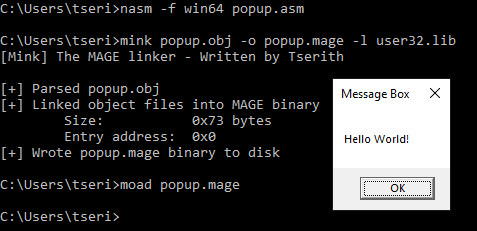

# Minimal Agnostic General Executable

The purpose of this project is to experiment with topics related to compilation rather than create a product with practical use cases. Thus, these tools will not safely parse malformed files. Do not use these tools on files you did not compile yourself.

## Tools

- Linker
- Loader
- Decompiler (in progress)
  - Dependency: [Zydis](https://github.com/zyantific/zydis)
- Compiler for custom object type (TBD)

## Limitations

- Executables are loaded into the process space of the loader
- Only recognizes .text section
- Only supports 64-bit COFF object files with position independent code
- Only supports the IMAGE_REL_AMD64_REL32 relocation type (functions)
- Does not support debugging symbols or exports
